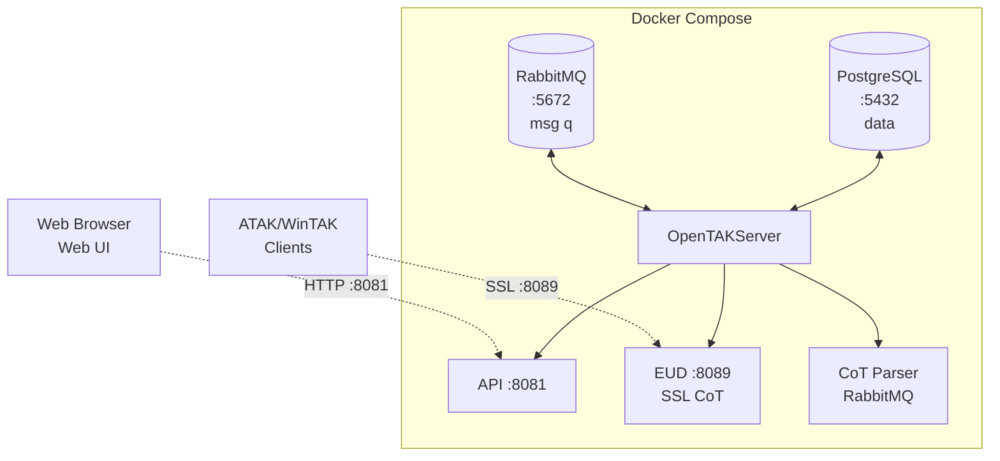

# 9M2PJU OpenTAKServer Docker

Production-ready Docker deployment of **[OpenTAKServer (OTS)](https://github.com/brian7704/OpenTAKServer)** — an open-source TAK (Team Awareness Kit) server compatible with ATAK, WinTAK, and iTAK clients.

## Architecture

## Why this exists

TAK is the de-facto standard for real-time situational awareness used by first responders, search & rescue, emergency management, and amateur radio operators worldwide. The official TAK server (TAK Server) is Java-heavy, painful to set up, and locked behind a portal. OpenTAKServer flips that — pure Python, actively developed, and now containerized.

This repo packages OTS into a clean, reproducible Docker Compose stack with PostgreSQL + RabbitMQ. No hand-tuned supervisord configs, no manual CA wrangling, no fragile host installs.

## What you get

- **Three-container stack** — PostgreSQL 16, RabbitMQ, and OpenTAKServer, isolated and scalable.
- **Automatic CA + client certificates** — OTS generates its own CA and issues per-user certs via the Web UI. No OpenSSL gymnastics.
- **ATAK / WinTAK / iTAK compatible** — speaks the same SSL CoT streaming protocol as the official TAK Server.
- **Web UI** — manage users, certs, data packages, and view the live map from a browser.
- **Persistent volumes** — database, certs, and config survive container rebuilds.
- **nginx-fronted Web UI** — clean HTTP access on `:8080` instead of exposing the raw Flask app.
- **GPL v3** — fully open source, no vendor lock-in, no phone-home.

## Use cases

- **Search & Rescue (SAR)** — track field teams in real time on a shared map, push overlay data to handhelds.
- **Emergency management / EOC** — coordinate multi-agency response with live positioning and chat.
- **Amateur radio / ARES / RACES** — field deployments for public service events and disaster comms.
- **Airsoft / MilSim** — blue-force tracker for organized scenario play.
- **Drone operations** — feed UAV positions into a common operating picture.
- **Maritime / AIS & ADS-B** — OTS ingests AIS and ADS-B feeds for vessel and aircraft tracking.
- **Meshtastic integration** — bridge LoRa mesh radios into the TAK picture.
- **Training & education** — stand up a classroom TAK server in minutes without licensing headaches.

## Comparison: OpenTAKServer vs FreeTAKServer

| Feature | OpenTAKServer | FreeTAKServer |
|---------|:------------:|:-------------:|
| Active Development | ✅ (2026) | ⚠️ Slower |
| Auto CA Generation | ✅ | ❌ |
| Certificate Enrollment | ✅ | ❌ |
| Groups/Channels | ✅ | ❌ |
| LDAP/AD | ✅ | ❌ |
| Meshtastic | ✅ | ❌ |
| ADSB/AIS Feeds | ✅ | ❌ |
| Device Profiles | ✅ | ❌ |
| Plugin System | ✅ | ❌ |
| Federation | Coming Soon | ✅ |
| ExCheck | Coming Soon | ✅ |
| Architecture | RabbitMQ + PostGIS | DigitalPy + ZeroMQ |

## License

This Docker deployment is provided under the [GNU General Public License v3.0](LICENSE).

OpenTAKServer itself is © Brian Wallen and contributors, licensed under GPL v3.

---

  <b>73 — 9M2PJU</b>
   
  <i>Open source TAK for everyone</i>

