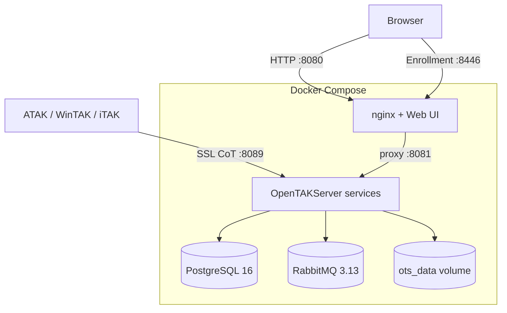

# 9M2PJU OpenTAKServer Docker

[](https://docs.opentakserver.io)
[](https://www.gnu.org/licenses/gpl-3.0)
[](https://docs.docker.com/compose/)
[](#platform-support)

Docker Compose packaging for [OpenTAKServer](https://github.com/brian7704/OpenTAKServer), a Python TAK server compatible with ATAK, WinTAK, and iTAK.

This repository builds a practical OTS stack with PostgreSQL, RabbitMQ, nginx, supervisord, the OpenTAKServer API, the OpenTAKServer Web UI, SSL CoT streaming, and certificate enrollment.

## What Is TAK?

The Team Awareness Kit (TAK) is a geospatial situational-awareness and collaboration ecosystem developed by the U.S. Department of Defense. It originated with the Android Team Awareness Kit (ATAK), which was developed by Air Force Research Laboratory (AFRL) scientists and engineers for military and special operations users. The ecosystem now includes clients such as ATAK, WinTAK, and iTAK, along with TAK servers that share operational data between connected teams.

Common uses include:

- Military and tactical field operations.
- Public safety and multi-jurisdiction incident response.
- Emergency management and disaster response.
- Search and rescue planning, tracking, and coverage mapping.
- Wildfire, law enforcement, medical, and infrastructure coordination.

TAK helps teams maintain a shared operational picture by exchanging locations, maps, markers, routes, files, chat, sensor data, and other Cursor-on-Target (CoT) messages. This OpenTAKServer deployment provides the server-side services that TAK clients use to connect and share that information.

For more background, see [AFRL's Tactical Assault Kit overview](https://afresearchlab.com/tactical-assault-kit-tak/), the [DHS Team Awareness Kit fact sheet](https://www.dhs.gov/publication/team-awareness-kit-fact-sheet), and the [DHS disaster-response example](https://www.dhs.gov/science-and-technology/news/2023/06/01/finding-common-ground-disaster-response).

Authored and maintained by [9M2PJU](https://hamradio.my).

## What You Get

- OpenTAKServer pinned to `1.7.13`.
- OpenTAKServer-UI pinned to `v1.7.5`.
- Three services: PostgreSQL 16, RabbitMQ 3.13, and OpenTAKServer.
- nginx Web UI on port `8080`.
- SSL CoT streaming on port `8089` for ATAK, WinTAK, and iTAK.
- Certificate enrollment on port `8446`.
- Persistent Docker volumes for database, RabbitMQ state, OTS config, CA files, logs, and user data.
- Multi-arch images for `linux/amd64` and `linux/arm64`.
- Healthchecks and capped container logs.

## Quick Start

### One-Line Installer

```bash
curl -fsSL https://raw.githubusercontent.com/9M2PJU/9M2PJU-Open-TAK-Server-Docker/main/scripts/install.sh | bash
```

The installer creates `./opentakserver`, downloads `docker-compose.yml` and `.env.example`, generates random database and RabbitMQ passwords, pulls the container images, and starts the stack.

Useful options:

```bash
curl -fsSL https://raw.githubusercontent.com/9M2PJU/9M2PJU-Open-TAK-Server-Docker/main/scripts/install.sh | bash -s -- --prefix ~/ots
curl -fsSL https://raw.githubusercontent.com/9M2PJU/9M2PJU-Open-TAK-Server-Docker/main/scripts/install.sh | bash -s -- --version v1.7.13
curl -fsSL https://raw.githubusercontent.com/9M2PJU/9M2PJU-Open-TAK-Server-Docker/main/scripts/install.sh | bash -s -- --no-start
curl -fsSL https://raw.githubusercontent.com/9M2PJU/9M2PJU-Open-TAK-Server-Docker/main/scripts/install.sh | bash -s -- --upgrade
```

### Manual Install

```bash
git clone https://github.com/9M2PJU/9M2PJU-Open-TAK-Server-Docker.git
cd 9M2PJU-Open-TAK-Server-Docker
cp .env.example .env
```

Edit `.env` and set strong values for:

```dotenv
POSTGRES_PASSWORD=change-me
RABBITMQ_DEFAULT_PASS=change-me
```

Start the stack:

```bash
docker compose up -d
```

Check status:

```bash
docker compose ps
docker compose logs -f opentakserver
```

## First Run

Give the stack about 60 seconds on first boot. OTS needs time to create its config, run migrations, generate its CA, and start the supervised services.

Open the Web UI:

```text
http://localhost:8080
```

For ATAK, WinTAK, or iTAK clients, use:

```text
SSL CoT streaming:  <server-ip>:8089
Certificate enroll: https://<server-ip>:8446
```

Use your server IP or DNS name instead of `localhost` when connecting from another device.

## Ports

| Host Port | Container Port | Purpose | Required |
|---:|---:|---|:---:|
| `8080` | `8080` | Web UI through nginx | Yes |
| `8081` | `8081` | Direct OTS Flask API access for debugging | No |
| `8089` | `8089` | SSL CoT streaming for TAK clients | Yes |
| `8446` | `8446` | Certificate enrollment | Yes |
| `8443` | `8443` | Optional HTTPS Web UI | No |
| `8088` | `8088` | Optional unencrypted TCP CoT streaming | No |

Only expose the ports you need. Avoid enabling unencrypted TCP CoT on `8088` for production use.

## Configuration

Configuration is controlled through `.env` and persisted runtime state under the `ots_data` Docker volume.

Required variables:

| Variable | Purpose |
|---|---|
| `POSTGRES_PASSWORD` | PostgreSQL password. Compose refuses to start without it. |
| `RABBITMQ_DEFAULT_PASS` | RabbitMQ password. Compose refuses to start without it. |

Common optional variables:

| Variable | Default | Purpose |
|---|---|---|
| `POSTGRES_DB` | `ots` | PostgreSQL database name |
| `POSTGRES_USER` | `ots` | PostgreSQL username |
| `RABBITMQ_DEFAULT_USER` | `ots` | RabbitMQ username |
| `OTS_CA_PASSWORD` | `atakatak` | Password used for the generated OTS CA |
| `OTS_CA_ORGANIZATION` | `MyOrg` | CA organization field |
| `OTS_CA_CITY` | `MyCity` | CA city field |
| `OTS_CA_STATE` | `MyState` | CA state field |
| `OTS_CA_COUNTRY` | `US` | CA country field |
| `OTS_SSL_STREAMING_PORT` | `8089` | Host port for SSL CoT streaming |
| `OTS_CERTIFICATE_ENROLLMENT_PORT` | `8446` | Host port for certificate enrollment |

Secret handling:

- `OTS_SECRET_KEY` and `OTS_SECURITY_PASSWORD_SALT` may be left blank.
- If blank, the container generates random values once and persists them to `/data/ots/config.yml`.
- Do not rotate these values casually. Changing them invalidates existing sessions and password hashes.
- Back up the `ots_data` volume before changing secrets or CA settings.

## Architecture


```mermaid
flowchart TB
    ATAK[ATAK / WinTAK / iTAK] -->|SSL CoT :8089| OTS
    Browser[Browser] -->|HTTP :8080| Nginx
    Browser -->|Enrollment :8446| Nginx

    subgraph Compose[Docker Compose]
        Nginx[nginx + Web UI]
        OTS[OpenTAKServer services]
        PG[(PostgreSQL 16)]
        RMQ[(RabbitMQ 3.13)]
        Data[(ots_data volume)]
        Nginx -->|proxy :8081| OTS
        OTS --> PG
        OTS --> RMQ
        OTS --> Data
    end
```

The OpenTAKServer container runs multiple processes under supervisord:

- nginx for the Web UI and reverse proxy.
- the OpenTAKServer Flask API.
- the EUD SSL handler for client streaming.
- the CoT parser.

## Platform Support

| Platform | Status | Image |
|---|---|---|
| Linux x86_64 / amd64 | Supported | `linux/amd64` |
| Linux arm64 / aarch64 | Supported | `linux/arm64` |
| FreeBSD | Supported through a Linux VM | `linux/amd64` or `linux/arm64` |

## Images

The image is published to GitHub Container Registry:

```text
ghcr.io/9m2pju/9m2pju-opentakserver:latest
```

Version tags are also published for releases, including tags in this style:

```text
ghcr.io/9m2pju/9m2pju-opentakserver:1.7.13
ghcr.io/9m2pju/9m2pju-opentakserver:1.7
ghcr.io/9m2pju/9m2pju-opentakserver:1
```

## Operations

Start:

```bash
docker compose up -d
```

Stop:

```bash
docker compose down
```

View logs:

```bash
docker compose logs -f
docker compose logs -f opentakserver
```

Restart only OTS:

```bash
docker compose restart opentakserver
```

Pull newer images and recreate containers:

```bash
docker compose pull
docker compose up -d --force-recreate
```

Back up persistent data:

```bash
docker run --rm -v 9m2pju-open-tak-server-docker_ots_data:/data -v "$PWD":/backup alpine tar czf /backup/ots-data-backup.tgz -C /data .
```

Your volume prefix may differ if your Compose project name is different. Confirm it with:

```bash
docker volume ls
```

## Build From Source

```bash
docker compose build
docker compose up -d
```

Override pinned versions at build time:

```bash
docker build \
  --build-arg OTS_VERSION=1.7.13 \
  --build-arg OTS_UI_VERSION=v1.7.5 \
  -t opentakserver-local .
```

## nginx and socket.io Note

This image intentionally uses nginx with `proxy_set_header Host $http_host;` for proxied OTS requests.

Do not change this to `$host`. `$host` strips the port from the `Host` header, while browser `Origin` headers keep the port. That mismatch causes socket.io requests to fail with `400 Not an accepted origin`.

Do not install `gevent-websocket` to force WebSocket transport in this container. This setup is designed to use socket.io long polling through nginx, which is the reliable mode for this packaging.

## Troubleshooting

Check whether containers are healthy:

```bash
docker compose ps
```

Read OTS logs:

```bash
docker compose logs -f opentakserver
```

Validate your Compose file and environment:

```bash
docker compose config -q
```

If the Web UI loads but live updates do not work, check that your nginx config still preserves the `Host` header with `$http_host`.

If clients cannot enroll certificates, confirm that port `8446` is reachable from the client network and that the OTS CA has been generated in the `ots_data` volume.

If ATAK, WinTAK, or iTAK cannot connect, confirm that port `8089` is reachable and that the client is using SSL CoT, not unencrypted TCP CoT.

## Development Checks

Before opening a pull request, run:

```bash
bash -n scripts/*.sh
cp .env.example .env.testenv
POSTGRES_PASSWORD=test RABBITMQ_DEFAULT_PASS=test docker compose --env-file .env.testenv config -q
rm .env.testenv
git grep -n $'\u2014'
git ls-files | grep -x AGENTS.md
```

Expected results:

- Shell syntax check exits cleanly.
- Compose validation exits cleanly.
- The em dash grep returns no files.
- `AGENTS.md` is not tracked.

## Use Cases

- Field TAK server for ATAK, WinTAK, and iTAK users.
- Search and rescue team tracking.
- Emergency operations center coordination.
- Amateur radio, ARES, and RACES deployments.
- Training environments and classroom labs.
- Airsoft, MilSim, and event operations.
- Drone, AIS, ADS-B, and Meshtastic workflows supported by OTS.

## Roadmap

- Run container processes as a non-root user.
- Pin the OpenTAKServer-UI release zip by SHA256.
- Add Dependabot or Renovate coverage for base images and pinned upstream versions.
- Add native non-Docker install notes for FreeBSD.

## Support

If this packaging saves you time, you can support maintenance here:

[](https://www.buymeacoffee.com/9m2pju)
[](https://wise.com/pay/me/faizulz13)

- Buy Me A Coffee: <https://www.buymeacoffee.com/9m2pju>
- Wise: <https://wise.com/pay/me/faizulz13>

## License

This Docker deployment is licensed under the [GNU General Public License v3.0](LICENSE).

OpenTAKServer is copyright Brian Wallen and contributors, licensed under GPL v3.
