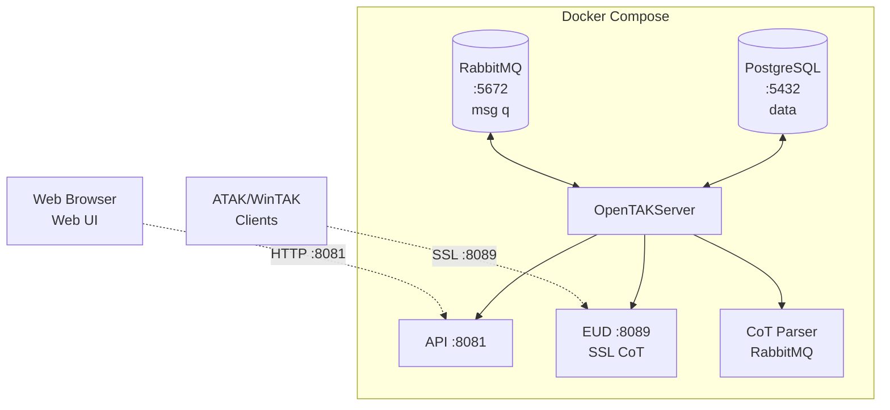

# 9M2PJU OpenTAKServer Docker

[](https://docs.opentakserver.io)
[](https://www.gnu.org/licenses/gpl-3.0)
[](https://docs.docker.com/compose/)
[](#platform-support)

Production-ready Docker deployment of **[OpenTAKServer (OTS)](https://github.com/brian7704/OpenTAKServer)** - an open-source TAK (Team Awareness Kit) server compatible with ATAK, WinTAK, and iTAK clients.

> Dockerized and maintained by **[9M2PJU](https://hamradio.my)**.

## Architecture


```mermaid
flowchart TB
    subgraph Compose[Docker Compose]
        PG[(PostgreSQL\n:5432\ndata)]
        RMQ[(RabbitMQ\n:5672\nmsg q)]
        OTS[OpenTAKServer]
        OTS --> API[API :8081]
        OTS --> EUD[EUD :8089\nSSL CoT]
        OTS --> CoT[CoT Parser\nRabbitMQ]
        PG <--> OTS
        RMQ <--> OTS
    end
    ATAK[ATAK/WinTAK\nClients] -. SSL :8089 .-> EUD
    WEB[Web Browser\nWeb UI] -. HTTP :8081 .-> API
```

## Why this exists

TAK is the de-facto standard for real-time situational awareness used by first responders, search & rescue, emergency management, and amateur radio operators worldwide. The official TAK server (TAK Server) is Java-heavy, painful to set up, and locked behind a portal. OpenTAKServer flips that - pure Python, actively developed, and now containerized.

This repo packages OTS into a clean, reproducible Docker Compose stack with PostgreSQL + RabbitMQ. No hand-tuned supervisord configs, no manual CA wrangling, no fragile host installs.

## Quick start

### One-line install (recommended)

```bash
curl -fsSL https://raw.githubusercontent.com/9M2PJU/9M2PJU-Open-TAK-Server-Docker/main/scripts/install.sh | bash
```

The installer:

- checks for Docker + the Compose v2 plugin,
- detects your OS/architecture (Linux x86_64 / arm64 / armv7, macOS Intel / Apple Silicon),
- downloads `docker-compose.yml` and `.env.example` into `./opentakserver/`,
- generates strong random `POSTGRES_PASSWORD` and `RABBITMQ_DEFAULT_PASS` into `.env` (preserved on re-runs),
- pulls the multi-arch image from GHCR and starts the stack,
- prints the Web UI / CoT / enrollment URLs.

Installer options:

```bash
... | bash -s -- --version v1.7.13 --prefix ~/ots --no-start
... | bash -s -- --upgrade        # re-pull + recreate containers in an existing dir
```

### Manual install

```bash
git clone https://github.com/9M2PJU/9M2PJU-Open-TAK-Server-Docker.git
cd 9M2PJU-Open-TAK-Server-Docker
cp .env.example .env
# edit .env: set POSTGRES_PASSWORD and RABBITMQ_DEFAULT_PASS (required)
docker compose up -d
```

Or pull the pre-built image directly:

```
ghcr.io/9m2pju/9m2pju-opentakserver:latest
```

Tagged releases also produce `:1.7.13`, `:1.7`, `:1` style tags.

## Platform support

| Platform | Status | How |
|---|---|---|
| Linux x86_64 (servers, VPS) | ✅ Native | `linux/amd64` image |
| Linux arm64 (Pi 4/5, Graviton, Ampere, Apple Silicon) | ✅ Native | `linux/arm64` image |
| Linux arm/v7 (Pi 3, Pi Zero 2 W, older 32-bit boards) | ✅ Native | `linux/arm/v7` image |
| macOS Intel | ✅ Via Docker Desktop | Linux container under the VM |
| macOS Apple Silicon | ✅ Via Docker Desktop | Native arm64 container |
| FreeBSD | ⚠️ Not via this Docker stack | Docker is not native on FreeBSD; use a Linux VM/jail or a host install of OpenTAKServer |

The OTS Python package itself is OS-agnostic, so the only platform-specific work is packaging system dependencies. The `scripts/` (entrypoint, supervisord, nginx, start) are portable shell + Python and work anywhere those services run.

## What you get

- **Three-container stack** - PostgreSQL 16, RabbitMQ, and OpenTAKServer, isolated and scalable.
- **Automatic CA + client certificates** - OTS generates its own CA and issues per-user certs via the Web UI. No OpenSSL gymnastics.
- **ATAK / WinTAK / iTAK compatible** - speaks the same SSL CoT streaming protocol as the official TAK Server.
- **Web UI** - manage users, certs, data packages, and view the live map from a browser.
- **Persistent volumes** - database, certs, and config survive container rebuilds.
- **nginx-fronted Web UI** - clean HTTP access on `:8080` instead of exposing the raw Flask app.
- **Multi-arch** - runs natively on **amd64** (x86_64 servers, cloud VPS), **arm64** (Raspberry Pi 4/5, AWS Graviton, Ampere, Apple Silicon), and **arm/v7** (Raspberry Pi 3, Pi Zero 2 W, other 32-bit boards). No arch-specific binaries, no emulation.
- **Pre-built images** - multi-arch images published to GHCR via GitHub Actions on every push to `main` and on version tags. Pull it instead of building from source:
  ```
  ghcr.io/9m2pju/9m2pju-opentakserver:latest
  ```
  Tagged releases also produce `:1.7.13`, `:1.7`, `:1` style tags.
- **GPL v3** - fully open source, no vendor lock-in, no phone-home.

## Use cases

- **Android ATAK in the field** - the primary client. ATAK on Android phones/tablets connects over SSL CoT to share position, chat, overlays, and imagery with the rest of the team. This server is the hub those handhelds report into.
- **Search & Rescue (SAR)** - track field teams in real time on a shared map, push overlay data to handhelds.
- **Emergency management / EOC** - coordinate multi-agency response with live positioning and chat.
- **Amateur radio / ARES / RACES** - field deployments for public service events and disaster comms.
- **Airsoft / MilSim** - blue-force tracker for organized scenario play.
- **Drone operations** - feed UAV positions into a common operating picture.
- **Maritime / AIS & ADS-B** - OTS ingests AIS and ADS-B feeds for vessel and aircraft tracking.
- **Meshtastic integration** - bridge LoRa mesh radios into the TAK picture.
- **Training & education** - stand up a classroom TAK server in minutes without licensing headaches.

## Comparison: OpenTAKServer vs FreeTAKServer

Sourced from the [official OpenTAKServer feature comparison](https://docs.opentakserver.io/feature_comparison.html) (OTS 1.7.x docs) and the [FreeTAKServer repo](https://github.com/FreeTAKTeam/FreeTakServer). FreeTAKServer 2.x is in active development and aims to close some of these gaps (federation, LDAP, protobuf CoT); the table below reflects the current stable FTS release.

| Feature | OpenTAKServer | FreeTAKServer |
|---------|:------------:|:-------------:|
| TCP / SSL CoT | ✅ | ✅ |
| Actively Developed | ✅ | ❌ (1.x stable; 2.x in progress) |
| Automatic CA Generation | ✅ | ❌ |
| Certificate Enrollment | ✅ | ❌ |
| EUD Authentication | ✅ | ❌ |
| Groups / Channels | ✅ | ❌ |
| Device Profiles | ✅ | ❌ |
| Plugin / Update Server | ✅ | ❌ |
| Data Packages / DataSync | ✅ | ✅ |
| Mission API | ✅ | ✅ |
| Federation | ⏳ Coming in 1.7.x | ✅ |
| ExCheck | ⏳ Coming Soon | ✅ |
| Video Streaming | ✅ | ✅ |
| Video Recording / Playback | ✅ | ❌ |
| Mumble Server Auth | ✅ | ❌ |
| ADS-B (Airplanes.live) | ✅ | ❌ |
| AIS (AISHub.net) | ✅ | ❌ |
| Meshtastic Bridge | ✅ | ❌ |
| LDAP / Active Directory | ✅ | ❌ (planned in 2.x) |
| 2FA (TOTP / Email) | ✅ | ❌ |
| Web UI with Live Map | ✅ | ✅ |
| Database | SQLAlchemy / PostGIS | SQLAlchemy / SQLite |
| Runs on Raspberry Pi | ✅ | ✅ |
| Language | Python | Python |
| License | GPL v3 | Eclipse Public License |

## Changelog

### Latest round of improvements

**One-line installer**
- New `scripts/install.sh`: a `curl | bash` bootstrap that detects OS/arch, downloads compose + env template, generates strong random passwords, pulls the image, and starts the stack. Supports `--version`, `--prefix`, `--no-start`, `--upgrade`.

**Platform coverage**
- CI now builds **`linux/arm/v7`** in addition to `amd64` and `arm64`, so Raspberry Pi 3 / Pi Zero 2 W / other 32-bit ARM boards run natively instead of under emulation.
- README documents the full platform matrix (Linux x86_64/arm64/armv7, macOS Intel/Apple Silicon via Docker Desktop, FreeBSD limitations).

**Dockerfile hardening**
- Switched to a **multi-stage build**: `gcc`, `libc6-dev`, `libpq-dev` live in a builder stage that produces wheels; the final runtime image only carries `libpq5`. Smaller image, no compiler toolchain shipped to production.
- **Pinned `opentakserver==1.7.13`** via a build arg (`OTS_VERSION`) instead of floating `pip install opentakserver`. Upgrades are now explicit.
- `OTS_UI_VERSION` exposed as both `ARG` and `ENV` for traceability.
- Added a `HEALTHCHECK` (curl against nginx on `:8080`) so orchestrators can detect a sick container.

**Compose / operations**
- Added a healthcheck for the `opentakserver` service (previously only postgres and rabbitmq had one).
- Added `json-file` log driver caps (`max-size: 10m`, `max-file: 3`) to all three services so logs can't fill the disk on long-running deployments.

**Config & onboarding**
- New `.env.example` documenting every required and optional variable with inline comments. Required passwords are clearly marked.
- README warns that rotating `OTS_SECRET_KEY` / `OTS_SECURITY_PASSWORD_SALT` invalidates sessions and password hashes.

**Build hygiene**
- New `.dockerignore` keeps `.git`, `.github`, local `.env`, `*.md` (except README), `__pycache__`, and `*.zip` out of the build context. Faster builds, smaller context, no accidental secret leakage.

**Script robustness**
- All shell scripts now use `set -euo pipefail` instead of just `set -e`.
- `scripts/wait-for-ca.sh` rewritten to remove the off-by-one in the timeout warning (it previously warned at iteration 60 *before* the final sleep, and the warning text said "60s" while the actual wait was 120s). Now correctly warns after 120s.
- `scripts/start.sh` CA-generation block no longer interpolates `${OTS_DATA_FOLDER}` directly into a Python string (which would break on paths containing single quotes); it reads `os.environ` inside Python instead.

### Roadmap (not yet done)

- Non-root container user (supervisor + nginx + OTS processes drop privileges).
- Pin the OpenTAKServer-UI zip by SHA256 checksum.
- Dependabot/Renovate config for base image, `OTS_VERSION`, `OTS_UI_VERSION`, postgres, and rabbitmq bumps.
- Native (non-Docker) install docs for macOS (Homebrew) and FreeBSD (pkg/jail).

## Support the project

If this Docker packaging saved you time, consider buying 9M2PJU a coffee or sending a tip via Wise. Every contribution helps keep the images rebuilt, the docs updated, and the Pi builds green.

[](https://www.buymeacoffee.com/9m2pju)
[](https://wise.com/pay/me/faizulz13)

- Buy Me A Coffee: <https://www.buymeacoffee.com/9m2pju>
- Wise: <https://wise.com/pay/me/faizulz13>

## License

This Docker deployment is provided under the [GNU General Public License v3.0](LICENSE).

OpenTAKServer itself is © Brian Wallen and contributors, licensed under GPL v3.

---

<div align="center">
  <b>73 - 9M2PJU</b>
  <br>
  <i>Open source TAK for everyone</i>
</div>
